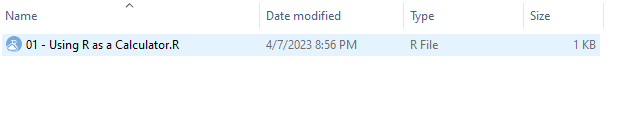

# R Programming for Absolute Beginners 👨‍🎓👩‍🎓

R is a programming language and software environment widely used for statistical computing and data analysis.  R provides a wide variety of statistical and graphical techniques, including linear and nonlinear modeling, classical statistical tests, time-series analysis, clustering, and more.

R is an open-source software, meaning that it is freely available for anyone to use and modify. It has become one of the most popular languages for data analysis and is used by researchers, analysts, and businesses around the world. Mostly, as it is a programming language tailored for data analysis, it works as an entry point for many non-coders into the data science and machine learning world.

This repository is designed to help absolute beginners get started with R, covering all the essential topics such as R as a calculator, vectors, data types, arrays, matrices, data frames, lists, libraries, working with data frames, reading external files, and functions.

**This repository is under license Creative Commons CC BY-SA. If you use any portion of it, please cite: *Bernardo, Ivo - R Programming: R Language For Absolute Beginners, 2022*** 

These materials are the base for my book *"R Programming: R Language for Absolute Beginners"* that you can buy on Amazon or Gumroad (in PDF format): 

- [Amazon](https://www.amazon.com/Programming-Language-Absolute-Beginners/dp/B0BQ94N9L7)
- [GumRoad](https://ivopbernardo.gumroad.com/l/rlanguagebeginners)

Additionally, you can find me explaining these materials (and more advanced stuff) on my [Udemy](https://www.udemy.com/course/r-for-absolute-beginners/?referralCode=F839A741D06F0200F312) course - currently a best seller on the platform.

This is what we approach during the learning scripts:

## R as a Calculator 🖩
These scripts will help you get familiar with R, by using it with it as a calculator! With R, you can perform all basic and complex arithmetic operations, while enjoying the flexibility and power of the programming language. Who needs a calculator when you have R?

## Vectors ➡️
The most basic R object and the first you should be familiar with. Vectors are similar to 1-dimensional arrays and you can use them to store and manipulate data of different types, and perform operations on them like a pro. This object is unidimensional and is able to hold a single data type at a time.

## Data Types 📊
R offers a variety of data types, including integers, doubles, logical, and character. But wait, there's more! R also has some special data types, such as factors and dates, that can make your life easier when dealing with complex data sets.

## Arrays ♾️
Arrays are like vectors on steroids. They allow you to store data of multiple dimensions, and perform operations on them with ease. If you want to take your data manipulation skills to the next level, then you definitely need to learn about arrays in R and how you can work with multidimensional objects.

## Matrices 👩‍💻
Matrices are very similar to arrays, but with their own constructor. You can use them to perform all sorts of matrix operations, like matrix multiplication, inversion, and eigenvalue decomposition. If you're into linear algebra, then matrices are your best friends!

## Data Frames 📙
Data frames are a special type of data structure that allow you to store and manipulate data in a tabular format. You can think of them as an object similar to spreadsheets or tables. With data frames, you can easily import, manipulate, and export data from and to external sources.

## Lists 📜
Lists are one of the most versatile data structures in R. They can store data of different types, including other lists, and can be nested to any level of depth. You can use them to represent complex data structures, and perform operations on them with ease.

## Libraries 📚
R has a vast ecosystem of libraries that can help you perform all sorts of tasks, from data manipulation and visualization, to machine learning and statistics. You can think of libraries as pre-built toolboxes that can save you a lot of time and effort.

## Working with Data Frames 📙
In this section, we'll dive deeper into data frames (the most important R object for data analysis), and learn how to perform some of the most common operations on them, such as filtering, sorting, grouping, and summarizing. We'll also learn how to visualize data frames using ggplot2, a popular data visualization library in R.

## Reading External Files 📂
Often times, you'll need to import data from external sources, such as CSV files, Excel spreadsheets, or SQL databases. In this section, we'll learn how to read and write data from and to different file formats.

## Functions 🧩
Functions are on of the building blocks of R programming. They allow you to encapsulate a piece of code into a reusable unit, and make your code more modular and organized. In this section, we'll learn how to define, call, and pass arguments to functions, and how to use some of the built-in functions in R.

I hope you enjoy learning R programming and that this repository helps you get started on your journey. If you have any questions, feel free to contact me at ivopbernardo@gmail.com

# Running the Materials

To run the materials, you need to install R base on your computer. If you want, you can also use them inside an IDE (this is the prefered version). In the examples below, we are using R Studio.

- [R Base Download](https://cran.r-project.org/bin/windows/base/)
- [R Studio Download](https://posit.co/download/rstudio-desktop/)

After installing both programs, navigate to a file in the course materials - here I'm exemplifying with the script in "1 - R as a Calculator\01 - Using R as a Calculator.R":

Double click the file and this will launch a new R Studio window on your computer:

Select the piece of code you want to execute in the script window, for example `1 + 1` on the example below:

After selecting, you can run this code in two ways - either by using the Run button on the top right or by hitting `CTRL + Enter` (Windows) or `CMD + Enter` (Mac). After executing, you can see the result of your code in the command line window: 

